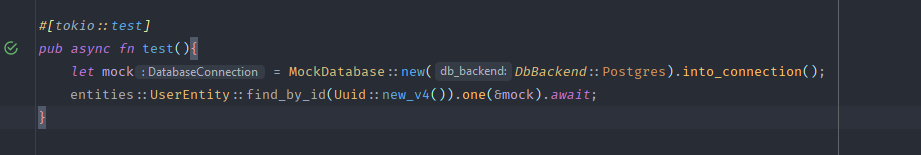
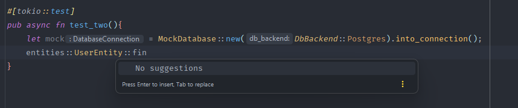
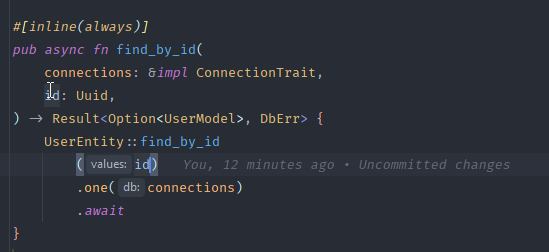
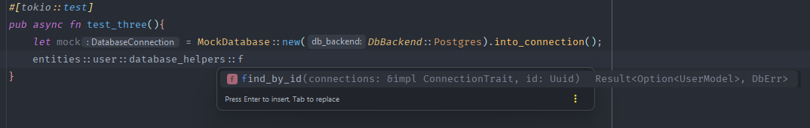

# Sea_ORM Function AutoComplete only available in current crate

## Project Layout
We have our main crate and within the crate. I have a second crate called entities. 

Entities is just all database entities relationship and some helping functions

Then our main crate is we have a lib.rs to show the issue. 

This is layout is copied from another project I have. 

## Issue
As you can see inside the lib.rs the text highlighting is not working 

The autocomplete is not working for the functions derived from sea_orm in the other crate

If we go into the database_helpers module inside the entities crate. All the features are working. 

The text highlighting and autocomplete is working for functions you made in the entities crate.
